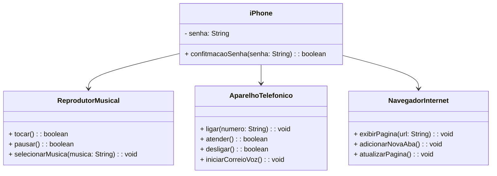

# Booticamp DIO

## Projeto de Modelagem UML: iPhone
Este projeto tem como objetivo principal aprimorar minhas hebilidade em diagramação UML (Unified Modeling Language) e aplicar esse conhecimentos no desenvolvimento prático de um projeto Java. Através de modelagem do iPhone, exploraremos os conceitos da programação orientada a objetos (POO) e suas apliacações em um cenário real.

## Tecnologias

- **Linguagem de Programação**: Java

- **Ferramenta de Diagramação**: UML, utilizando o draw.io

## Diagrama:
